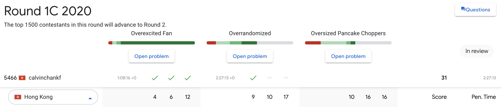

## Google Code Jam 2020

### Round 1C

|     | Question          | small dataset | medium dataset | large dataset | remarks                   |
| --- | ----------------- | ------------- | -------------- | ------------- | ------------------------- |
| A   | Overexcited Fan   | ✅            | ✅             | ✅            | hashtable + binary search |
| B   | Overrandomized    | ✅            | ❌             | ❌            | hashtable                 |
| C   | Oversized Pancake | ❌            | ❌             | ❌            | no idea for now           |

score: 31/100

