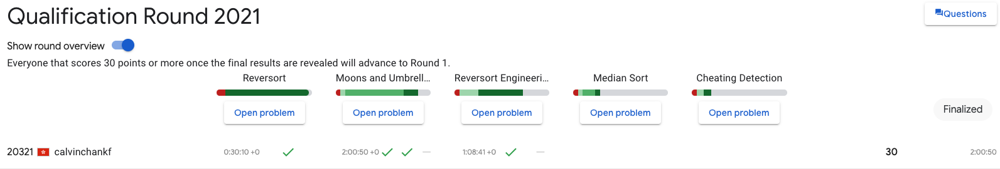

## Google Code Jam 2020

### Qualification Round

|     | Question              | small dataset | large dataset | extra large | remarks     |
| --- | --------------------- | ------------- | ------------- | ----------- | ----------- |
| A   | Reversort             | ✅            |               |             | brute force |
| B   | Moons and Umbrellas   | ✅            | ✅            |             | greedy      |
| C   | Reversort Engineering | ✅            | ❌            |             | brute force |
| D   | Median Sort           | ❌            | ❌            | ❌          | lazy me     |
| E   | Cheating Detection    | ❌            | ❌            |             | lazy me     |

score: 30/100

---

